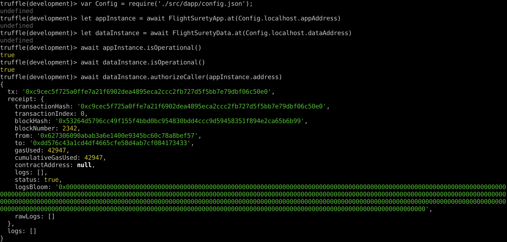
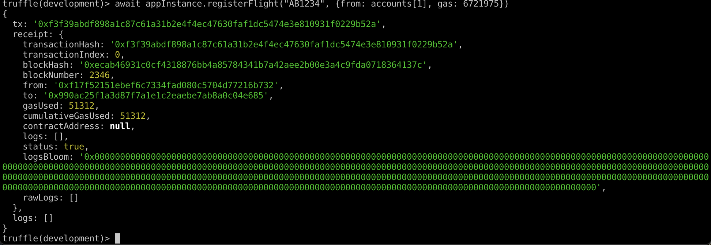
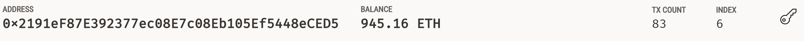
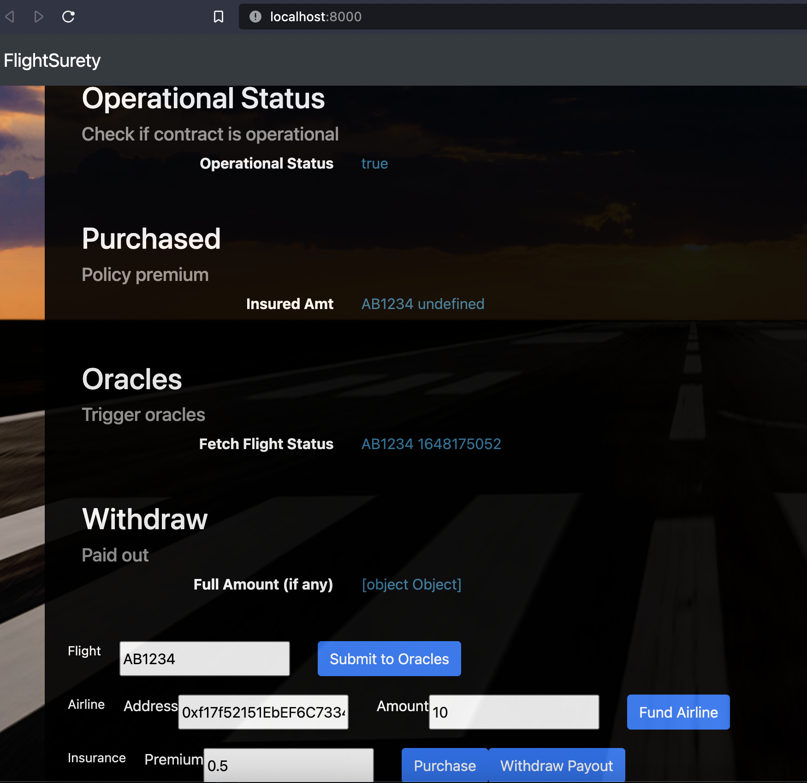
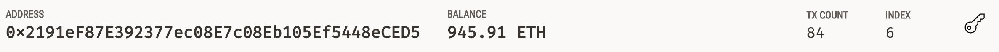

### Node Version
v17.2.0

### Truffle Version
v5.4.22

### Web3 Version
1.6.1

# Demo Steps

## Ganache
Create workspace,
Make sure to create enough accounts (e.g. 50), give 1000 ETH each.
The accounts are assigned as follow (also defined in `contracts.js`):

```
accounts[1] first airline
'0xf17f52151EbEF6C7334FAD080c5704D77216b732'

airlines: accounts[1] - accounts[5]

passengers: accounts[6] - accounts[10]
i.e. passengers[0] is accounts[6]

oracles: accounts[30]-accounts[49]
```


## Deploy
truffle deploy --reset

## Frontend
```
npm run dapp
```

## Backend
```
npm run server
```

## Authorize app contracts to call into data contracts
```
truffle console
var Config = require('./src/dapp/config.json');
let appInstance = await FlightSuretyApp.at(Config.localhost.appAddress)
let dataInstance = await FlightSuretyData.at(Config.localhost.dataAddress)
await appInstance.isOperational()
await dataInstance.isOperational()
await dataInstance.authorizeCaller(appInstance.address)
await appInstance.fundAirline({from:accounts[1], value: web3.utils.toWei("10", "ether"), gas: 6721975})
await appInstance.registerAirline(accounts[2], {from: accounts[1]})
await appInstance.fundAirline({from:accounts[2], value: web3.utils.toWei("10", "ether"), gas: 6721975})
```


 
## Register flight

If you get `Uncaught TypeError: Cannot read properties of undefined (reading 'match')`
make sure there is no extra spaces!!! This is a weird truffle bug.

This works.
```
await appInstance.registerFlight("AB1234", {from: accounts[1], gas: 6721975})
```

This one fails!!! There are two spaces after the comma (before gas).
```
await appInstance.registerFlight("AB1234", {from: accounts[1],  gas: 6721975})
```

Bacause the status code is generated randomly, you may need to test it again if you get `On Time (10)` the first time, so register additional flights.

```
await appInstance.registerFlight("AB1234a", {from: accounts[1], gas: 6721975})
await appInstance.registerFlight("AB1234b", {from: accounts[1], gas: 6721975})
await appInstance.registerFlight("AB1234c", {from: accounts[1], gas: 6721975})
```


## Purchase
Go to `http://localhost:8000/`

Airline: 0xf17f52151EbEF6C7334FAD080c5704D77216b732

Flight No: AB1234

Put 0.5 ETH on the value field.

Click Purchase

## Oracle response
Click on Submit to send the request event, and the server will simulate oracles responses.

## Withdraw
Pay attention to the balance of
```
passengers[0] which is account[6] == 0x2191eF87E392377ec08E7c08Eb105Ef5448eCED5
```

Click **Withdraw Payout**

Ganache does not auto refresh balance, click "SWITCH" to manually refresh. Note: the rpc endpoint will disconnect, you might have to rerun server manually. It should show the new balance.

The balance before withdraw is `945.16 ETH`, and after withdraw is `945.91 ETH`. `945.91 - 945.16 = 0.75 ETH` which is 1.5x of the `0.5 ETH` insurance purchased!